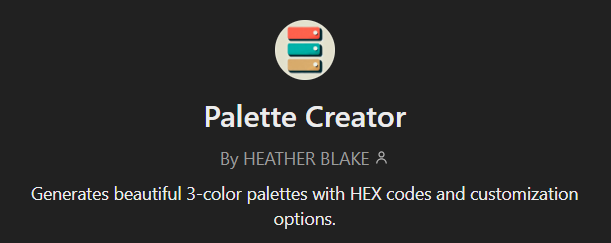
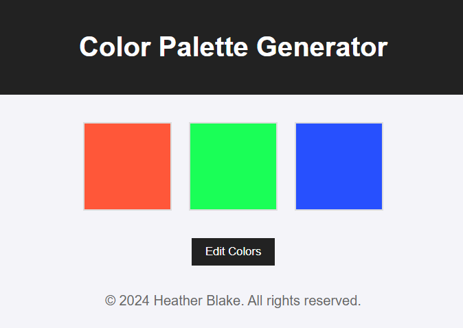

# **Color Palette Generator**

### **Description**
A simple web app that generates beautiful 3-color palettes based on user-provided themes or preferences. Users can view, edit, and customize their palettes directly on the app. Built with HTML, CSS, and JavaScript, this project serves as a foundation for future features like account creation and advanced design tools.

---

### **Features**
- Generate harmonious 3-color palettes using the GPT.
- View and edit colors in the web app.
- User-friendly interface.

---

### **GPT Demo**
This demo is intended to demonstrate the custom GPT and the web app. To view the GPT, you must have a ChatGPT Plus Plan. The GPT will provide an opportunity to request a custom 3-color palette and a link to the associated web app.

To view the Color Palette GPT, visit the GPT store:  [Color Palette GPT](https://chatgpt.com/g/g-6755c739fdfc8191b0151bd06ce24cb4-palette-creator)

 

Example prompt: 
    
    Create a retro-style palette for a gaming website.

Example response:

    🎨 Retro-Style Gaming Website Palette:

        Vibrant Coral Red (#FF5E5B)  
        Classic Cobalt Blue (#2E86AB)  
        Goldenrod Yellow (#F6C85F)  

    🔗 View and customize your palette here: Color Palette Generator

---

### **Web App Demo**

To view the Color Palette Generator web app without using the GPT, visit the live app: [Color Palette Generator](https://hblake316.github.io/color-palette/). Pass the colors query parameter to display them on the home page. The colors query parameter should be a comma-separated list of HEX codes.

Example URL: 

https://hblake316.github.io/color-palette/?colors=%23FF5E5B,%232E86AB,%23F6C85F



---

### **Getting Started**

#### **Prerequisites**
To run this app locally, you'll need:
- A code editor like [VS Code](https://code.visualstudio.com/).
- A browser (e.g., Chrome, Firefox).

#### **Installation**
1. Clone the repository:
   ```bash
   git clone https://github.com/hblake316/color-palette.git

2. Navigate to the project directory:
   ```bash
   cd color-palette

3. Open `index.html` in your browser or run a local server:
   - Using VS Code, install the [Live Server](https://marketplace.visualstudio.com/items?itemName=ritwickdey.LiveServer) extension and open the project with Live Server.

---

### **Technologies Used**
- **HTML**: For the structure of the app.
- **CSS**: For styling and layout.
- **JavaScript**: For functionality and interactivity.
- **GitHub Pages**: For hosting the app.
- **ChatGPT Store**: For creating and hosting the GPT.

---

### **Future Enhancements**
- Add account creation and user login system.
- Expand palettes to 5 or more colors with advanced customization options.
- Allow users to download palettes in various formats (e.g., CSS, JSON).

---

### **Contact**
Created by [Heather Blake](https://github.com/hblake316)  
For questions or feedback, reach out at: hblake.dev@gmail.com
